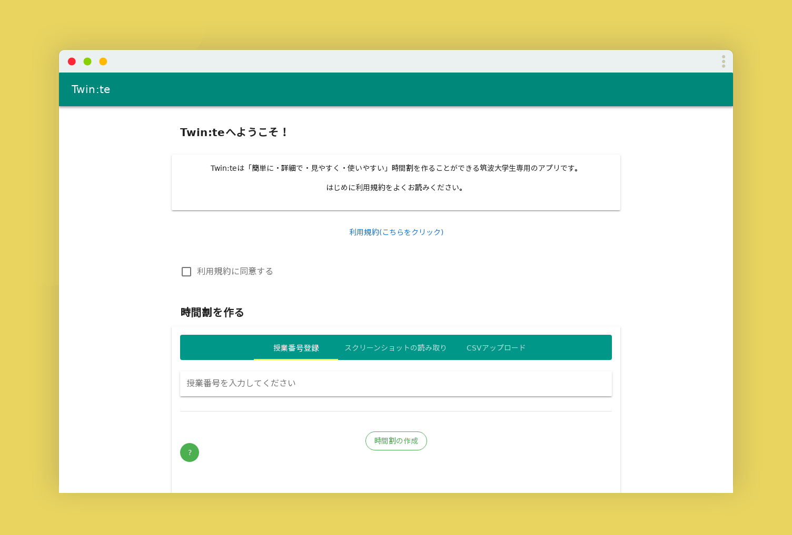
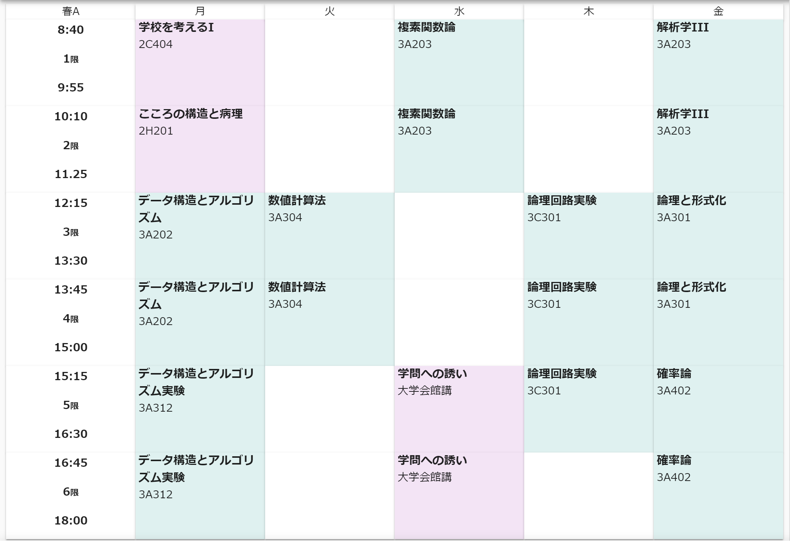

**[Duplicated] => see https://github.com/twin-te/twinte-front**

# twin:te

- アプリケーションURL => https://twinte.net
- アプリ紹介LP => https://twinte.netlify.com
- 公式Twitter => https://twitter.com/te_twin

# v1.3

<blockquote class="twitter-tweet" data-lang="ja">
【新機能情報】 授業の出席率やメモをできる機能を実装しました！ 出席の管理にお使いください！ <a href="https://t.co/sP5WUsFKIt">pic.twitter.com/sP5WUsFKIt</a>
&mdash; Twin:te (@te_twin) <a href="https://twitter.com/te_twin/status/1114839586008518656?ref_src=twsrc%5Etfw">2019年4月7日</a></blockquote>

# v1.2

<blockquote class="twitter-tweet" data-lang="ja">
【新機能情報】 twinsログイン機能が廃止になった代わりに、他に便利に時間割を作れる機能を実装しました！ 授業番号のスクショを撮ってアップロードするだけで自動で時間割に追加されます！ぜひお試しを！<a href="https://twitter.com/hashtag/twinte?src=hash&amp;ref_src=twsrc%5Etfw">#twinte</a> <a href="https://t.co/VyK78w4bWw">https://t.co/VyK78w4bWw</a> <a href="https://t.co/n7Rcqgabvi">pic.twitter.com/n7Rcqgabvi</a>
&mdash; Twin:te (@te_twin) <a href="https://twitter.com/te_twin/status/1100035368311676928?ref_src=twsrc%5Etfw">2019年2月25日</a></blockquote>

# v1.1

<blockquote class="twitter-tweet" data-lang="ja">
危険性について指摘されているので、一旦サイトを閉鎖します。  大学に報告して大学の返答次第で運営するかどうかを決めます。
&mdash; Twin:te (@te_twin) <a href="https://twitter.com/te_twin/status/1095573333242855425?ref_src=twsrc%5Etfw">2019年2月13日</a></blockquote>

<blockquote class="twitter-tweet" data-lang="ja">
現在csvをアップロードすることで時間割を表示できる機能のみ有効になっています。csvはtwinsからダウンロードできますので、そちらをご利用ください。  ダウンロードはtwinsの履修タブからできます。 <a href="https://t.co/F9VFkehVMM">pic.twitter.com/F9VFkehVMM</a>
&mdash; Twin:te (@te_twin) <a href="https://twitter.com/te_twin/status/1095620153415327744?ref_src=twsrc%5Etfw">2019年2月13日</a></blockquote>

# v1.0

<blockquote class="twitter-tweet" data-lang="ja">
Twin:teはパソコン・スマートフォン・タブレットのどの端末からでもご利用いただけます。  スマートフォンの場合はアプリとして利用すると非常に便利です！<a href="https://t.co/VyK78w4bWw">https://t.co/VyK78w4bWw</a><a href="https://twitter.com/hashtag/twinte?src=hash&amp;ref_src=twsrc%5Etfw">#twinte</a> <a href="https://t.co/ke454tkAav">pic.twitter.com/ke454tkAav</a>
&mdash; Twin:te (@te_twin) <a href="https://twitter.com/te_twin/status/1095484850411192320?ref_src=twsrc%5Etfw">2019年2月13日</a></blockquote>

## 動作仕様

- LocalStorage確認、復元できればログイン状態になる
- 復元データがなければ未ログイン状態、ログイン画面が自動的に表示される
- 教科をクリックすると詳細画面が出てきてmoreをおすとシラバス画面が出てくる
- 詳細画面では名前の変更が可能、saveを押したとき、画面が閉じると同時にvuexへコミットされる
- シラバスはボタンを押すと取得されて表示されるbackで詳細画面に戻る

# 記事など

[Twin:teの動作原理について解説](https://itf-hikary.hatenablog.com/entry/2019/02/13/180339)
